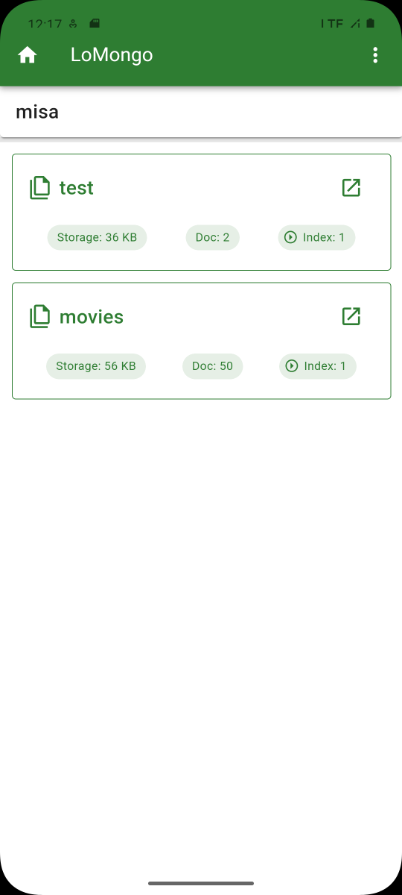
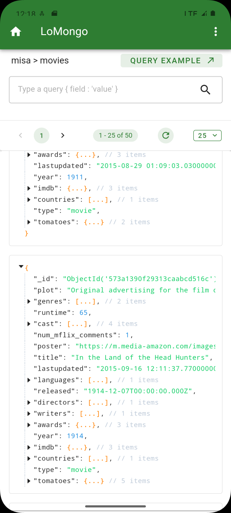

# LoMongo

| [English](README.md) | [简体中文](README.zh-CN.md) |

LoMongo, an Android client for MongoDB service data browsing and retrieval, using **[Tauri2](https://tauri.app/)** and **[Rust](https://www.rust-lang.org/)**.

## 🚀Features

- Use TCP/IP connection
- Use SSH tunneling connection (port forwarding)
- Connection pool optimization
- Data cryptographic storage
- Browse databases and collections
- Perform custom queries

## Interface

<table>
  <tr>
	<td></td>
	<td></td>
  </tr>
  <tr>
	<td></td>
  </tr>
</table>

## Note

You can browse and query the MongoDB database away from your computer or server. If it's for learning on a local mobile device, then pairing it with [Termux](https://github.com/termux) should have a different effect.
