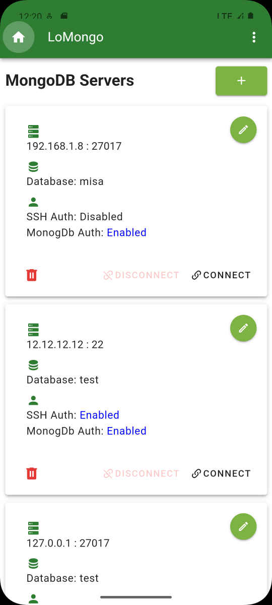
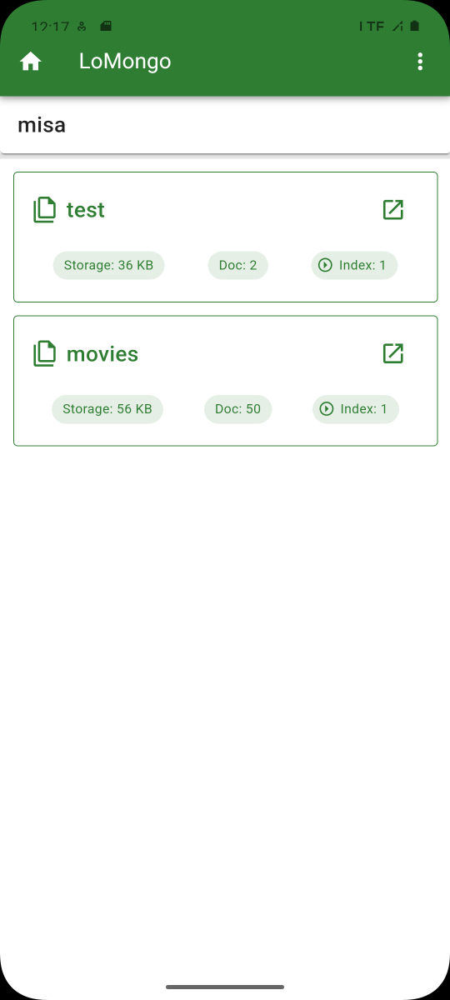
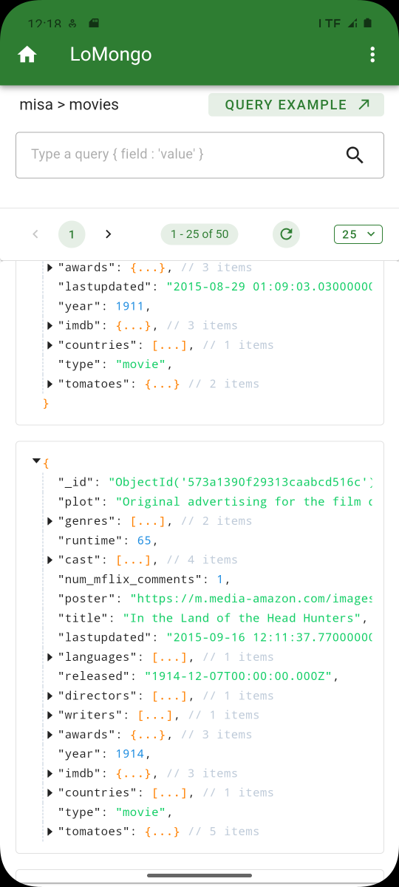

# LoMongo

| [English](README.md) | [简体中文](README.zh-CN.md) |

LoMongo，一个支持 MongoDB 服务数据浏览与检索的 Android 客户端，使用 [Tauri2](https://tauri.app/) 与 [Rust](https://www.rust-lang.org/)。

## 🚀功能特性

- 使用 TCP/IP 连接
- 使用 SSH 隧道连接（端口转发）
- 连接池优化
- 数据密码加密存储
- 浏览数据库和集合
- 执行自定义查询

## 界面

<table>
  <tr>
    <td></td>
    <td></td>
  </tr>
  <tr>
    <td></td>
  </tr>
</table>

## Release

[安装包](https://github.com/leleo886/LoMongo/releases)

## 说明

你可以在远离电脑或服务器的情况下浏览查询MongoDB数据库。如果是为了在本地移动设备学习那么与 [Termux](https://github.com/termux) 搭配应该会有不一样的效果感觉。
